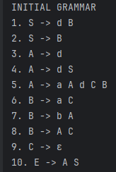
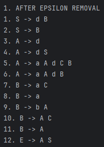
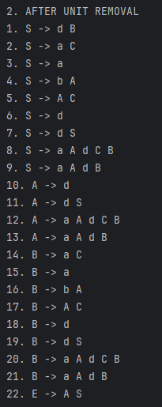
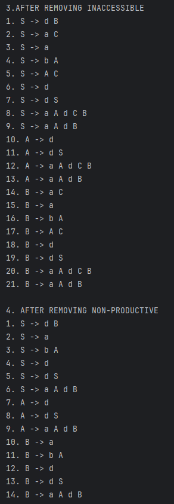
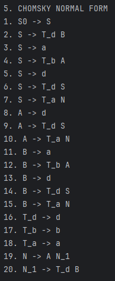
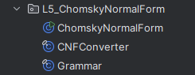

# Laboratory 5 – Chomsky Normal Form

### Course: Formal Languages & Finite Automata
### Author: Felicia Ojog
### Variant: 19

----

## Theory

Chomsky Normal Form (CNF) is a standard form for context-free grammars used in formal language theory to simplify grammar structure and enable efficient parsing.

A grammar is in CNF if all production rules are of the form:

- A → BC (two non-terminals)
- A → a (a single terminal)
- S → ε (only allowed for the start symbol, in specific cases)

This restriction ensures that derivations are binary and structured, which is useful for algorithms such as CYK.


### Context-Free Grammar

A context-free grammar is defined as:

G = (V, Σ, P, S)

where:
- V is the set of non-terminals
- Σ is the alphabet (terminals)
- P is the set of productions
- S is the start symbol


### CNF Conversion Steps

To convert a grammar into CNF, the following transformations are applied:

1. Elimination of ε-productions
2. Elimination of unit productions
3. Removal of inaccessible symbols
4. Removal of non-productive symbols
5. Conversion to CNF structure (A → BC or A → a)


### Importance of CNF

CNF provides a standardized structure for context-free grammars, making them easier to analyze and use in algorithmic applications.

One of the main advantages of CNF is that it enforces a strict format for production rules. This simplifies grammar processing and allows the use of well-known parsing algorithms such as the Cocke–Younger–Kasami (CYK) algorithm.

Additionally, CNF provides a uniform representation of derivations, which is useful when proving theoretical properties of languages. It also allows easier comparison between grammars and helps in reasoning about language equivalence.

Another benefit is that unnecessary or redundant productions are removed during the transformation process, resulting in a cleaner and more efficient grammar.

Overall, CNF is important both in theoretical computer science and in practical applications involving syntax analysis and language processing.


## Objectives

The objectives of this laboratory work were:

- Study the concept of Chomsky Normal Form
- Understand grammar normalization techniques
- Implement a Java program to convert a grammar to CNF
- Apply transformations sequentially
- Avoid hardcoded solutions
- Display intermediate transformation results


### Variant 19

The grammar used in this laboratory is:

```
1. S -> d B
2. S -> B
3. A -> d
4. A -> d S
5. A -> a A d C B
6. B -> a C
7. B -> b A
8. B -> A C
9. C -> ε
10. E -> A S
```


## Implementation Description

The implementation was developed in Java using an object-oriented approach. The solution is structured into multiple classes to improve modularity and clarity.

The program represents the grammar as a structured data model and applies a sequence of transformations to convert it into Chomsky Normal Form.

Each transformation step modifies the grammar while preserving its language.


### Grammar Representation

The grammar is stored using a mapping between non-terminals and their productions. Each production is represented as a list of symbols.

This approach allows flexible manipulation of rules and avoids duplication during transformations.


### CNF Conversion Process

The conversion is performed in several steps:

1. **Epsilon elimination**  
   Nullable non-terminals are identified and removed while preserving equivalent productions.

2. **Unit production elimination**  
   Unit productions are replaced using transitive closure.

3. **Removing inaccessible symbols**  
   Only symbols reachable from the start symbol are preserved.

4. **Removing non-productive symbols**  
   Only symbols that can derive terminal strings are kept.

5. **Final CNF transformation**
    - Terminals in long productions are replaced with new variables
    - Productions are reduced to binary form


### Dynamic Implementation

The implementation is fully dynamic:

- It accepts grammar rules as input
- It does not depend on hardcoded cases
- It works for any grammar in the same format


## Code Implementation

### Main Method

```java
public static void main(String[] args) {
    List<String> rules = List.of(
        "1. S -> d B",
        "2. S -> B",
        "3. A -> d",
        "4. A -> d S",
        "5. A -> a A d C B",
        "6. B -> a C",
        "7. B -> b A",
        "8. B -> A C",
        "9. C -> ε",
        "10. E -> A S"
    );

    Grammar grammar = Grammar.fromRules("S", rules);

    CNFConverter converter = new CNFConverter(grammar);

    converter.eliminateEpsilonProductions();
    converter.eliminateUnitProductions();
    converter.removeInaccessibleSymbols();
    converter.removeNonProductiveSymbols();
    converter.convertToCNF();
}
```

The main method initializes the grammar and applies each transformation step sequentially. The grammar is printed after each step to observe the evolution.


### CNF Conversion Method

```java
public void convertToCNF() {
    // replaces terminals with variables
    // breaks productions into binary form
}
```


### Grammar Parsing

```java
public static Grammar fromRules(String startSymbol, List<String> rules)
```


## Results

The program successfully converts the initial grammar into Chomsky Normal Form.

Each transformation step produces a valid intermediate grammar:

- ε-productions are removed correctly
- unit productions are eliminated
- inaccessible symbols (such as E) are removed
- non-productive symbols are eliminated
- final productions respect CNF rules

The final grammar contains only valid CNF productions.


## Screenshots

### 1. Initial Grammar



Displays the original grammar as provided in the input. All productions are shown in their initial form, before any normalization steps are applied.


### 2. After Epsilon Removal



Shows the grammar after eliminating ε-productions. Nullable symbols are removed, and new equivalent productions are introduced to preserve the language.


### 3. After Unit Removal



Displays the grammar after removing unit productions. Rules of the form A → B are replaced with their corresponding non-unit productions using transitive closure.


### 4. After Cleaning



Shows the grammar after removing inaccessible and non-productive symbols. Only symbols that are reachable from the start symbol and can derive terminal strings are retained.


### 5. Final CNF Output



Displays the final grammar in Chomsky Normal Form. All productions conform to CNF rules, meaning they are either of the form A → BC or A → a.


### 6. Code Structure



Shows the project structure used in the implementation. The solution is organized into separate classes for clarity and modularity:
- ChomskyNormalForm.java
- Grammar.java
- CNFConverter.java


## Conclusion

## Conclusion

In this laboratory work, the process of transforming a context-free grammar into Chomsky Normal Form was studied and implemented in a systematic way.

The implementation successfully follows all required normalization steps, including elimination of ε-productions, removal of unit productions, and filtering of inaccessible and non-productive symbols. Each transformation step was applied carefully to ensure that the language generated by the grammar remains unchanged throughout the process.

The final stage of the algorithm restructures the grammar into proper CNF by introducing new non-terminals for terminals in complex productions and breaking longer productions into binary rules. As a result, the final grammar strictly follows the CNF constraints, containing only productions of the form A → BC or A → a.

A key aspect of this work is the dynamic nature of the solution. The program does not rely on hardcoded rules and can handle any grammar provided in the expected format. This demonstrates a clear understanding of the underlying algorithms and their general applicability.

Additionally, organizing the solution into separate classes improves code readability and maintainability. The modular design makes it easier to extend or modify the implementation in future tasks.

Overall, this laboratory work reinforces the connection between theoretical concepts from formal language theory and their practical implementation. It highlights how grammar normalization techniques can be applied programmatically to produce structured and analyzable representations of languages.

## References

[1] Chomsky Normal Form – Wikipedia  
https://en.wikipedia.org/wiki/Chomsky_normal_form
[2] LabN3exemplu_engl - Example laboratory work provided as reference material (PDF)