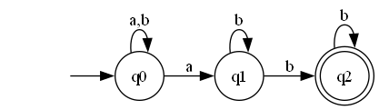
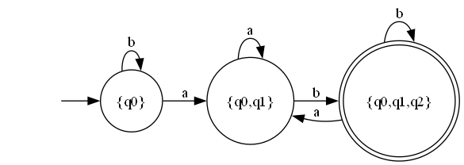
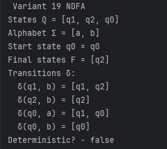
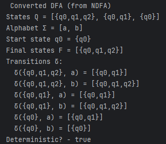
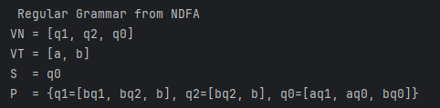
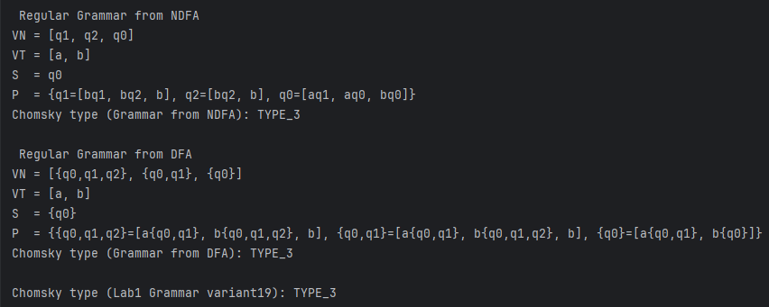

# Laboratory 2 – Finite Automata and Regular Grammars

### Course: Formal Languages & Finite Automata
### Author: Felicia Ojog
### Variant: 19

----

## Theory

Automata theory studies abstract computational models used to recognize formal languages.  
One of the most important models is the **finite automaton**, which processes strings of symbols and determines whether the strings belong to a particular language.

A **finite automaton (FA)** is defined as a 5–tuple:

```
M = (Q, Σ, δ, q0, F)
```

Where:

- **Q** – finite set of states
- **Σ** – input alphabet
- **δ** – transition function
- **q0** – initial state
- **F** – set of accepting states

The automaton reads the input string symbol by symbol and moves between states according to the transition function.

If the automaton finishes reading the input and the final state belongs to **F**, the string is **accepted by the language**.


## Deterministic vs Non-Deterministic Automata

### Deterministic Finite Automaton (DFA)

A deterministic finite automaton has exactly **one possible transition** for every state and input symbol.

The transition function is defined as:

```
δ : Q × Σ → Q
```

This means the next state is uniquely determined.


### Non-Deterministic Finite Automaton (NDFA)

A nondeterministic finite automaton allows **multiple transitions** for the same input symbol.

The transition function is defined as:

```
δ : Q × Σ → P(Q)
```

Where **P(Q)** is the power set of states.

This means the automaton may move to several possible states simultaneously.

A string is accepted if **any possible path leads to a final state**.


## NDFA → DFA Conversion

Even though NDFA and DFA behave differently, they recognize the **same class of languages (regular languages)**.

Every NDFA can be converted into an equivalent DFA using the **subset construction algorithm**.

In this method:

- Each DFA state represents a **set of NDFA states**.

Example:

```
{q0, q1}
```

represents a DFA state containing both states.

A DFA state is **accepting** if it contains at least one NDFA accepting state.


## Regular Grammar

A grammar is defined as:

```
G = (VN, VT, P, S)
```

Where:

- **VN** – set of non-terminal symbols
- **VT** – set of terminal symbols
- **P** – production rules
- **S** – start symbol

The language generated by the grammar consists of all terminal strings derivable from **S** using the production rules.


## Chomsky Hierarchy

Grammars can be classified according to the **Chomsky hierarchy**:

| Type | Grammar | Production Rule Form |
|--|--|--|
| Type 0 | Unrestricted | α → β |
| Type 1 | Context-Sensitive | αAβ → αγβ |
| Type 2 | Context-Free | A → β |
| Type 3 | Regular | A → aB or A → a |

Where:

- **A** is a non-terminal
- **a** is a terminal
- **α, β, γ** are strings of terminals and non-terminals

Regular grammars correspond directly to **finite automata**, meaning both models describe the same class of languages.


## Objectives

The objectives of this laboratory work were:

- Implement a **Non-Deterministic Finite Automaton (NDFA)**.
- Determine whether an automaton is **deterministic or nondeterministic**.
- Convert an **NDFA to an equivalent DFA**.
- Convert a **finite automaton into a regular grammar**.
- Implement a method to classify grammars according to the **Chomsky hierarchy**.
- Represent the automaton graphically using **Graphviz**.


## Implementation Description

The implementation builds upon the solution developed in **Laboratory 1** and extends it with additional functionality.

Project structure:

```
src
 ├── lab1
 │   ├── Grammar.java
 │   ├── FiniteAutomaton.java
 │   └── Main.java
 │
 └── lab2
     └── MainLab2.java

docs
 ├── lab1
 └── lab2
     ├── README.md
     └── images
```


## Grammar Class

The `Grammar` class represents a formal grammar:

```
G = (VN, VT, P, S)
```

It stores:

- `VN` – non-terminal symbols
- `VT` – terminal symbols
- `P` – production rules
- `S` – start symbol


### Grammar Initialization

The grammar for **Variant 19** is defined as follows:

```java
public static Grammar variant19() {

    Set<String> VN = Set.of("S", "A", "B", "C");
    Set<Character> VT = Set.of('a', 'b');

    Map<String, List<String>> P = new HashMap<>();

    P.put("S", List.of("aA"));
    P.put("A", List.of("bS", "aB"));
    P.put("B", List.of("bC"));
    P.put("C", List.of("aA", "b"));

    return new Grammar(VN, VT, P, "S");
}
```

This grammar is **right-linear**, therefore it is a **Type 3 (regular) grammar**.


## FiniteAutomaton Class

The `FiniteAutomaton` class models both deterministic and nondeterministic automata.

It stores:

- `states` – set of states
- `alphabet` – input alphabet
- `delta` – transition function
- `startState` – initial state
- `finalStates` – accepting states


### Membership Checking

The method `stringBelongToLanguage()` checks whether a string is accepted by the automaton.

```java
public boolean stringBelongToLanguage(String input) {

    Set<String> currentStates = new HashSet<>();
    currentStates.add(startState);

    for (char symbol : input.toCharArray()) {

        Set<String> nextStates = new HashSet<>();

        for (String state : currentStates) {

            Map<Character, Set<String>> transitions = delta.get(state);
            if (transitions == null) continue;

            Set<String> targets = transitions.get(symbol);
            if (targets != null)
                nextStates.addAll(targets);
        }

        currentStates = nextStates;
    }

    for (String s : currentStates)
        if (finalStates.contains(s))
            return true;

    return false;
}
```

The algorithm tracks all possible states reachable after reading each symbol.


## NDFA → DFA Conversion

The NDFA is converted into a deterministic automaton using the **subset construction algorithm**.

Each DFA state represents a **set of NDFA states**.

Example:

```
{q0,q1,q2}
```

A DFA state is accepting if it contains an NDFA final state.


## Finite Automaton → Regular Grammar

An automaton can be converted into an equivalent regular grammar.

For every transition:

```
δ(qi, a) = qj
```

a production rule is created:

```
qi → a qj
```

If `qj` is a final state, we also add:

```
qi → a
```

This demonstrates the equivalence between **finite automata and regular grammars**.


## Chomsky Hierarchy Classification

The `Grammar` class includes a method that determines the grammar type.

```java
public ChomskyType classifyChomsky() {

    if (isType3Regular())
        return ChomskyType.TYPE_3;

    if (isType2ContextFree())
        return ChomskyType.TYPE_2;

    if (isType1ContextSensitive())
        return ChomskyType.TYPE_1;

    return ChomskyType.TYPE_0;
}
```

The classification algorithm checks production rules from the most restrictive type to the most general:

1. **Type 3 – Regular Grammar**
2. **Type 2 – Context-Free Grammar**
3. **Type 1 – Context-Sensitive Grammar**
4. **Type 0 – Unrestricted Grammar**

For the grammar used in this laboratory, the result is:

```
TYPE_3 (Regular Grammar)
```

because all productions follow the right-linear form:

```
A → aB
A → a
```


## Automaton Definition (Variant 19)

The NDFA used in this laboratory is defined as:

```
Q = {q0, q1, q2}
Σ = {a, b}
F = {q2}
```

Transitions:

```
δ(q0,a) = {q0,q1}
δ(q0,b) = {q0}
δ(q1,b) = {q1,q2}
δ(q2,b) = {q2}
```

This automaton is **non-deterministic** because multiple transitions exist for the same symbol.


## Graphical Representation

### NDFA



### DFA



These diagrams were generated using **Graphviz**.


## Execution Results

### NDFA Output




### DFA Conversion




### Grammar Generated from Automaton




### Chomsky Classification




## Conclusions

In this laboratory work, the theoretical concepts of **finite automata and formal grammars** were implemented and analyzed through practical programming tasks.

A nondeterministic finite automaton was created and tested for language membership. The automaton was converted into an equivalent deterministic finite automaton using the subset construction algorithm.

Additionally, the automaton was transformed into a regular grammar and classified according to the **Chomsky hierarchy**.

The implementation demonstrates the theoretical equivalence between **finite automata and grammars**, providing practical insight into formal language models used in compiler design and language processing.


## References


[1] Formal Languages & Finite Automata – Theme 1: Regular Grammars, Course Slides (PDF).

[2] Formal Languages & Finite Automata – Lecture 22 Presentation, Course Slides (PDF).
