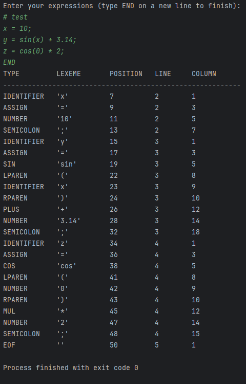
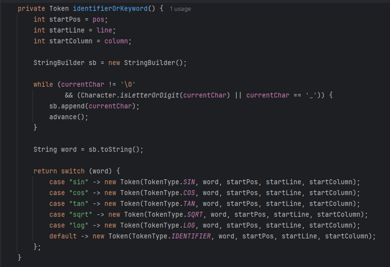
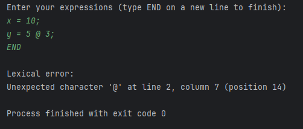

# Laboratory 3 – Lexical Analysis (Lexer / Scanner)

### Course: Formal Languages & Finite Automata
### Author:
### Variant: 19

----

## Theory

**Lexical analysis** is the first stage of language processing in a compiler or interpreter. Its purpose is to transform a sequence of raw characters into a sequence of structured elements called **tokens**, which can then be used by later stages such as parsing and semantic analysis. Instead of working directly with individual characters, these later stages operate on tokens, which provide a higher-level and more meaningful representation of the input.

This phase acts as an interface between the raw input and higher-level processing stages. By converting text into tokens, the lexer simplifies the structure of the program and removes irrelevant elements such as whitespace and comments.


### Lexemes and Tokens

A **lexeme** is a sequence of characters in the input that matches a pattern defined by the lexical grammar. A **token**, on the other hand, is the abstract representation assigned to that lexeme.

A token is defined as:

```
Token = (type, value)
```

Where:

- **type** – category of the token (e.g., IDENTIFIER, NUMBER)
- **value** – the actual lexeme extracted from the input

For example, in the expression:

```
x = 10;
```

the lexer produces the following tokens:

```
(IDENTIFIER, "x")
(ASSIGN, "=")
(NUMBER, "10")
(SEMICOLON, ";")
```

This distinction is essential because it allows the compiler or interpreter to operate on structured data instead of raw text. The parser does not need to know how the token was formed; it only needs to know its type and value.


### Token Categories

In programming languages, tokens are typically divided into several categories such as identifiers, keywords, operators, delimiters, and literals. Identifiers represent user-defined names, such as variables or function names. Keywords are reserved words with predefined meaning in the language, such as mathematical functions in this laboratory (`sin`, `cos`, etc.).

Operators are symbols that define computations, while delimiters are used to structure expressions and separate elements. Literals represent constant values, such as integers or floating-point numbers. In addition, comments and whitespace may appear in the input, but they are usually ignored by the lexer because they do not contribute to the syntactic structure of the language.

These categories allow the lexer to organize the input into meaningful units that can be easily processed by the parser.


### Lexical Grammar

The lexical structure of a language is described using **regular expressions**, which define valid patterns for lexemes. For example, an identifier can be defined as a letter or underscore followed by a sequence of letters, digits, or underscores, while a number can be defined as a sequence of digits with an optional decimal part.

Examples:

- Identifier:
  ```
  [a-zA-Z_][a-zA-Z0-9_]*
  ```

- Number:
  ```
  [0-9]+(\.[0-9]+)?
  ```

These expressions define how valid tokens are recognized in the input stream. Since regular expressions describe **regular languages**, lexical analysis is directly connected to the theory of finite automata studied in previous laboratories. In practice, a lexer can be viewed as an implementation of a finite automaton that recognizes valid token patterns.


### Role of the Lexer

The lexer reads the input sequentially, character by character, and groups characters into lexemes according to the rules of the lexical grammar. It then classifies these lexemes into tokens and produces a stream of tokens as output.

During this process, the lexer ignores whitespace and comments, since they are not required for syntactic analysis. It also detects invalid characters or sequences that do not match any token pattern and reports them as lexical errors.

It is important to note that the lexer does not evaluate expressions or check whether the input is syntactically correct. For example, it can recognize parentheses as tokens, but it does not verify whether they are properly balanced. Such checks are performed in later stages of processing.

## Objectives

The objectives of this laboratory work were:

- Design and implement a **lexer (scanner)** in Java
- Define a set of token categories for a small expression language
- Recognize identifiers, numbers, operators, and keywords
- Support floating-point numbers and mathematical functions
- Handle comments and whitespace
- Provide structured token output for further processing


## Implementation Description

The implementation is structured into the `lab3` package:

```
src
 ├── lab1
 ├── lab2
 └── lab3
     ├── TokenType.java
     ├── Token.java
     ├── Lexer.java
     └── MainLab3.java

docs
 ├── lab1
 ├── lab2
 └── lab3
     ├── README.md
     └── images
```

The solution follows a modular design, where each class corresponds to a specific concept in lexical analysis. This separation improves readability and makes the system easier to extend.


## TokenType Class

The `TokenType` enum defines all lexical categories supported by the language.

```java
public enum TokenType {
    NUMBER,
    IDENTIFIER,

    SIN, COS, TAN, SQRT, LOG,

    PLUS, MINUS, MUL, DIV, MOD, POW, ASSIGN,

    LPAREN, RPAREN, COMMA, SEMICOLON,

    EOF
}
```

These categories reflect the elements of a small mathematical expression language. In addition to general token types such as numbers and identifiers, the lexer includes predefined function names as keywords, along with arithmetic operators and delimiters.


## Token Class

The `Token` class represents a single lexical unit.

```java
public class Token {
    private final TokenType type;
    private final String lexeme;
    private final int position;
    private final int line;
    private final int column;
}
```

Each token stores its type and lexeme, as well as positional information such as the index, line, and column where it appears. This information is particularly useful for debugging and for reporting errors in a precise and user-friendly way.


## Lexer Class

The `Lexer` class implements the core logic of lexical analysis. It processes the input sequentially and generates tokens based on the current character and its context.

The lexer maintains internal state variables such as the current position, line number, and column number. As it advances through the input, it updates these values to keep track of where each token is located.

When the lexer encounters digits, it constructs numeric tokens by reading consecutive digits and optionally a decimal point. This allows it to recognize both integer and floating-point values. A validation mechanism ensures that only one decimal point is present in a number.

```java
private Token number() {
    int startPos = pos;
    int startLine = line;
    int startColumn = column;

    StringBuilder sb = new StringBuilder();
    boolean hasDot = false;

    while (currentChar != '\0' && (Character.isDigit(currentChar) || currentChar == '.')) {
        if (currentChar == '.') {
            if (hasDot) {
                throw error("Invalid number format");
            }
            hasDot = true;
        }

        sb.append(currentChar);
        advance();
    }

    return new Token(TokenType.NUMBER, sb.toString(), startPos, startLine, startColumn);
}
```

When the lexer encounters letters or underscores, it constructs identifiers by reading alphanumeric characters. After forming a lexeme, it checks whether it matches any predefined keyword such as `sin`, `cos`, `tan`, `sqrt`, or `log`. If a match is found, a keyword token is produced; otherwise, the lexeme is treated as an identifier.

```java
private Token identifierOrKeyword() {
    int startPos = pos;
    int startLine = line;
    int startColumn = column;

    StringBuilder sb = new StringBuilder();

    while (currentChar != '\0'
            && (Character.isLetterOrDigit(currentChar) || currentChar == '_')) {
        sb.append(currentChar);
        advance();
    }

    String word = sb.toString();

    return switch (word) {
        case "sin" -> new Token(TokenType.SIN, word, startPos, startLine, startColumn);
        case "cos" -> new Token(TokenType.COS, word, startPos, startLine, startColumn);
        case "tan" -> new Token(TokenType.TAN, word, startPos, startLine, startColumn);
        case "sqrt" -> new Token(TokenType.SQRT, word, startPos, startLine, startColumn);
        case "log" -> new Token(TokenType.LOG, word, startPos, startLine, startColumn);
        default -> new Token(TokenType.IDENTIFIER, word, startPos, startLine, startColumn);
    };
}
```

Operators and delimiters are recognized directly as single-character tokens and mapped to their corresponding types. Symbols such as `+`, `-`, `*`, `/`, `%`, `^`, and `=` are classified as operators, while `(`, `)`, `,`, and `;` are classified as delimiters.

```java
switch (currentChar) {
    case '+' -> {
        tokens.add(new Token(TokenType.PLUS, "+", startPos, startLine, startColumn));
        advance();
    }
    case '-' -> {
        tokens.add(new Token(TokenType.MINUS, "-", startPos, startLine, startColumn));
        advance();
    }
    case '*' -> {
        tokens.add(new Token(TokenType.MUL, "*", startPos, startLine, startColumn));
        advance();
    }
    case '/' -> {
        tokens.add(new Token(TokenType.DIV, "/", startPos, startLine, startColumn));
        advance();
    }
    case '%' -> {
        tokens.add(new Token(TokenType.MOD, "%", startPos, startLine, startColumn));
        advance();
    }
    case '^' -> {
        tokens.add(new Token(TokenType.POW, "^", startPos, startLine, startColumn));
        advance();
    }
    case '=' -> {
        tokens.add(new Token(TokenType.ASSIGN, "=", startPos, startLine, startColumn));
        advance();
    }
    case '(' -> {
        tokens.add(new Token(TokenType.LPAREN, "(", startPos, startLine, startColumn));
        advance();
    }
    case ')' -> {
        tokens.add(new Token(TokenType.RPAREN, ")", startPos, startLine, startColumn));
        advance();
    }
    case ',' -> {
        tokens.add(new Token(TokenType.COMMA, ",", startPos, startLine, startColumn));
        advance();
    }
    case ';' -> {
        tokens.add(new Token(TokenType.SEMICOLON, ";", startPos, startLine, startColumn));
        advance();
    }
    default -> throw error("Unexpected character '" + currentChar + "'");
}
```

The lexer also skips whitespace and comments. Comments begin with the `#` symbol and are ignored until the end of the line. This ensures that non-essential text does not affect the token stream.

```java
private void skipComment() {
    while (currentChar != '\0' && currentChar != '\n') {
        advance();
    }
}
```

Error handling is an important part of the implementation. If the lexer encounters an unexpected character that does not match any valid token pattern, it throws an exception containing detailed positional information. In the `MainLab3` class, this exception is caught using a `try/catch` block, allowing the program to display a clean error message instead of terminating abruptly.


### Numbers

Supports:

```
10
3.14
0.5
```


### Identifiers and Keywords

Keywords:

```
sin, cos, tan, sqrt, log
```

All other names are treated as identifiers.


### Operators

```
+  -  *  /  %  ^  =
```


### Delimiters

```
( ) , ;
```


### Comments

```
# this is a comment
```


### Error Handling

If an invalid character is encountered, the lexer throws an error with position details. This error is handled in the main program using a `try/catch` block, which ensures that the program prints a clear message instead of crashing.


## MainLab3 Class

The `MainLab3` class demonstrates the functionality of the lexer.

Features:

- Reads input from the keyboard
- Supports multi-line input
- Stops when `END` is entered
- Prints tokens in a structured format
- Handles lexical errors gracefully using `try/catch`


## Results / Screenshots

### Input and Token Output

The execution of the program demonstrates how the lexer processes a sequence of input expressions and transforms them into a structured stream of tokens. The input includes variable assignments, arithmetic expressions, and predefined mathematical functions. Comments and whitespace are ignored during processing, while valid elements are converted into tokens such as identifiers, numbers, operators, and delimiters.

The output is displayed in a tabular format, where each token is associated with its type, lexeme, and position in the input. This confirms that the lexer correctly identifies and classifies all lexical elements according to the defined rules.




### Code Implementation

The implementation of the lexer demonstrates how lexical rules are translated into program logic. The code shown focuses on the mechanism used to recognize identifiers and predefined keywords.

The lexer reads characters sequentially and builds a lexeme by grouping letters, digits, and underscores. Once the lexeme is formed, it is compared against a set of predefined keywords such as `sin`, `cos`, `tan`, `sqrt`, and `log`. If a match is found, the corresponding keyword token is generated; otherwise, the lexeme is classified as an identifier.

This part of the implementation highlights how the lexer differentiates between user-defined names and reserved words, ensuring that each element of the input is assigned the correct token type.




### Error Handling Example

The program also handles invalid input by detecting unexpected characters during tokenization. When such a character appears, the lexer generates an error containing information about its position in the input.

Instead of terminating abruptly, the program catches this error and displays a clear and user-friendly message. This behavior confirms that the implementation is robust and capable of handling incorrect input gracefully.



## Conclusions

In this laboratory work, the concept of lexical analysis was studied and implemented in practice through the development of a lexer in Java. The implemented program processes a stream of input characters and transforms it into a structured sequence of tokens, demonstrating the fundamental role of lexical analysis as the first stage in language processing.

The lexer successfully identifies and classifies different categories of tokens, including identifiers, numeric literals, operators, delimiters, and predefined keywords such as mathematical functions. It also correctly ignores non-essential elements such as whitespace and comments, ensuring that only meaningful lexical units are passed to subsequent processing stages. The addition of structured error handling further improves the robustness of the implementation by allowing invalid input to be reported clearly without interrupting program execution.

From a theoretical perspective, this laboratory reinforces the connection between lexical analysis and formal language theory. The recognition of tokens is based on regular patterns, which correspond to regular languages and can be modeled using finite automata. This demonstrates how the concepts studied in previous laboratories are directly applied in practical software systems.

Furthermore, the clear separation between lexical analysis and later stages such as parsing and semantic analysis is evident in this implementation. The lexer is responsible only for tokenization and does not evaluate expressions or enforce syntactic correctness, illustrating the modular architecture of language processing systems.

Overall, this laboratory provided a solid understanding of lexical analysis and its role in compiler design. It also demonstrated how theoretical concepts from formal languages and automata can be translated into a working implementation, forming the foundation for more advanced stages such as parsing and interpretation.


## References

[1] Formal Languages & Finite Automata – Lexer / Scanner Laboratory Material (PDF)  
[2] Lexical Analysis – Wikipedia  