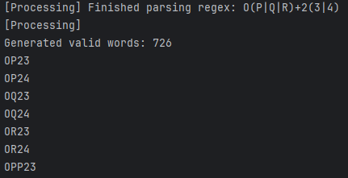
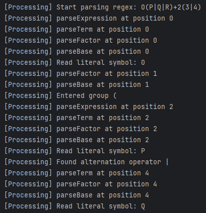
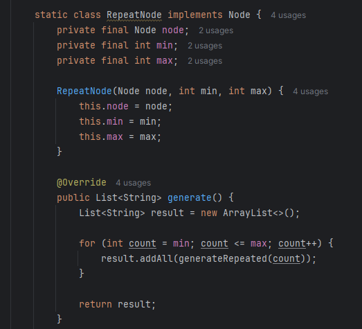

# Laboratory 4 – Regular Expressions

### Course: Formal Languages & Finite Automata
### Author: Felicia Ojog
### Variant: 3

----

## Theory

Regular expressions are a formal method used to describe patterns over a finite alphabet. They are widely used in formal language theory to define **regular languages**, which are the class of languages that can be recognized by finite automata. Regular expressions provide a compact and expressive way to specify sets of valid strings without listing them explicitly.


### Alphabet (Σ)

An **alphabet** is a finite, non-empty set of symbols.

In this laboratory work, the alphabet is defined by the symbols used in the given regular expressions.

For Variant 3:

Σ = { A, B, C, D, E, F, G, H, I, J, K, L, M, N, O, P, Q, R, 2, 3, 4 }


### Strings and Language

A **string (word)** is a finite sequence of symbols from the alphabet Σ.

The set of all possible strings over Σ is denoted by **Σ\***.

A **language** is any subset of Σ\*.  
In this laboratory, each regular expression defines a language consisting of all strings that satisfy its pattern.

For example:

```
O(P|Q|R)+2(3|4)
```

defines a language where every string:
- starts with `O`
- contains one or more symbols from `{P, Q, R}`
- is followed by `2`
- ends with either `3` or `4`


### Regular Expressions

A **regular expression** is a formal notation used to describe regular languages.

It is constructed using symbols and operators. A single symbol represents a language containing that symbol. More complex expressions are built by combining simpler expressions using operations such as concatenation, alternation, and repetition.

Regular expressions are defined recursively:
- a symbol is a regular expression
- if `r` and `s` are regular expressions, then `rs`, `r|s`, and `(r)*` are also regular expressions


### Operators in Regular Expressions

Regular expressions use several operators to define patterns:

- **Concatenation**  
  Represents sequential symbols  
  Example: `AB`

- **Alternation ( | )**  
  Represents a choice  
  Example: `(C|D|E)`

- **Kleene Star ( * )**  
  Zero or more repetitions  
  Example: `A*`

- **Plus ( + )**  
  One or more repetitions  
  Example: `J+`

- **Optional ( ? )**  
  Zero or one occurrence  
  Example: `O?`

- **Exact Repetition ( ^n )**  
  Exactly `n` repetitions  
  Example: `(P|Q)^3`

- **Grouping ( )**  
  Used to group expressions  
  Example: `(P|Q|R)+`


### Operator Precedence

Regular expressions follow a strict order of evaluation:

1. Parentheses `( )`
2. Repetition operators (`*`, `+`, `?`, `^n`)
3. Concatenation
4. Alternation `|`

This ensures correct interpretation of expressions.


### Regular Languages and Automata

Regular expressions are equivalent to finite automata. Every regular expression can be transformed into an equivalent automaton that recognizes the same language.

In this laboratory, instead of constructing an automaton, the expressions are interpreted programmatically to generate all valid strings.


## Objectives

The objectives of this laboratory work were:

- Study the concept of regular expressions
- Understand how regular expressions define formal languages
- Implement a Java program that dynamically interprets expressions
- Generate valid strings for the given expressions
- Avoid hardcoding logic
- Limit repetitions (`*`, `+`) to maximum 5
- Implement the bonus requirement (processing sequence display)


### Variant 3

The laboratory was completed for Variant 3:

1. `O(P|Q|R)+2(3|4)`
2. `A*B(C|D|E)F(G|H|I)^2`
3. `J+K(L|M|N)*O?(P|Q)^3`


## Implementation Description

The implementation was developed in Java using a dynamic parsing and generation approach.

The program does not process each regular expression separately. Instead, it applies a general algorithm that interprets any valid expression using the supported operators. This ensures that the solution is reusable and not dependent on specific hardcoded cases.

The solution is divided into two main stages:

- **Parsing the expression**
- **Generating valid strings**

During the parsing stage, the program reads the regular expression from left to right and analyzes its structure. It identifies literals, grouped subexpressions, alternation operators, and repetition operators. Based on this analysis, it constructs an internal representation in the form of a tree, where each node corresponds to a component of the expression.

Each type of node has a specific role. Literal nodes represent individual symbols, sequence nodes represent concatenation, alternation nodes represent branching choices, and repetition nodes handle repetition operators. This structure reflects the hierarchical nature of the expression and respects operator precedence.

During the generation stage, the constructed structure is traversed recursively. Each node generates a set of strings according to its role, and these results are combined to form complete valid words. This approach allows the program to correctly handle nested expressions and complex combinations of operators.

Special attention is given to repetition operators such as `*` and `+`, which theoretically allow infinite repetition. To ensure that the program produces a finite output, a maximum limit of 5 repetitions is imposed. This satisfies the requirements of the assignment and prevents excessive computation.

An additional feature of the implementation is the processing trace. While parsing, the program outputs messages describing each step, making the internal interpretation of the expression visible. This provides a clear sequence of operations and fulfills the bonus requirement.


## Code Implementation

### Main Method

```java
public static void main(String[] args) {
    String[] expressions = {
            "O(P|Q|R)+2(3|4)",
            "A*B(C|D|E)F(G|H|I)^2",
            "J+K(L|M|N)*O?(P|Q)^3"
    };

    for (String expr : expressions) {
        Parser parser = new Parser(expr, true);
        Node root = parser.parse();

        List<String> results = root.generate();

        System.out.println("Expression: " + expr);
        for (String word : results) {
            System.out.println(word);
        }
    }
}
```

The main method defines the three regular expressions required for Variant 3 and processes them sequentially. Each expression is passed to a parser, which converts it into an internal node-based structure.

The instruction `parser.parse()` performs the structural analysis of the expression and builds the corresponding tree representation. The result of this process is stored in the variable `root`, which represents the entire expression.

The method `root.generate()` then produces all valid strings described by the expression. These strings are printed to the console, allowing verification of correctness.

This design demonstrates that the same logic is applied uniformly to all expressions, confirming that the implementation is fully dynamic.


### RepeatNode Example

```java
static class RepeatNode implements Node {
    private final Node node;
    private final int min;
    private final int max;

    RepeatNode(Node node, int min, int max) {
        this.node = node;
        this.min = min;
        this.max = max;
    }

    @Override
    public List<String> generate() {
        List<String> result = new ArrayList<>();

        for (int count = min; count <= max; count++) {
            result.addAll(generateRepeated(count));
        }

        return result;
    }
}
```

The `RepeatNode` class is responsible for handling all repetition operators in a unified way. Instead of treating each operator separately, the program converts them into a repetition interval defined by a minimum and maximum number of occurrences.

For example:
- `*` corresponds to the interval `[0, 5]`
- `+` corresponds to `[1, 5]`
- `?` corresponds to `[0, 1]`
- `^n` corresponds to `[n, n]`

The method `generate()` iterates through each possible repetition count within the interval. For each value, it generates all combinations of repeated subexpressions and adds them to the result.

This design allows the program to handle all repetition cases consistently while also enforcing the maximum limit of 5 repetitions. As a result, infinite generation is avoided, and the output remains manageable.


### Processing Function (Bonus)

```java
private void log(String message) {
    if (trace) {
        System.out.println("[Processing] " + message);
    }
}
```

This function is used to display the sequence of processing steps during parsing. It is called at key moments in the parser, such as when a symbol is read, a group is entered or exited, or an operator is applied.

Although simple, this function plays an important role in making the internal behavior of the program visible. The messages printed in the console reflect the exact order in which the expression is interpreted.

By observing these messages, it is possible to understand how the parser processes the input step by step. This satisfies the bonus requirement of showing the sequence of processing of the regular expression.


## Results

The execution of the program produces valid strings for each of the three regular expressions defined in Variant 3. The results are displayed in the console, where each expression is followed by the list of generated words.

For the first expression, the generated strings clearly follow the pattern defined by the expression. All words begin with the symbol `O`, followed by one or more symbols from the set `{P, Q, R}`, then the digit `2`, and end with either `3` or `4`. The variation in length of the middle part confirms the correct implementation of the `+` operator.

For the second expression, the results include strings with different numbers of `A` symbols at the beginning, ranging from zero to five occurrences. This is followed by a fixed structure and exactly two symbols from `{G, H, I}` at the end. The consistency of the last two symbols confirms that the `^2` operator is handled correctly.

For the third expression, the generated strings begin with one or more `J` symbols, followed by `K`, and optionally include symbols from `{L, M, N}` as well as the symbol `O`. Each string ends with exactly three symbols from `{P, Q}`, which verifies the correct behavior of the `^3` operator.

In addition to the generated words, the console output also includes processing messages that describe how each expression is parsed step by step. These messages provide a clear view of the internal logic of the program.


## Screenshots

### Program Execution



The console output presents each regular expression followed by the generated valid strings. The variation in structure and length of the words demonstrates the correct handling of repetition, alternation, and grouping operators.


### Processing Sequence (Bonus)



The console also includes processing messages that show how the regular expression is interpreted step by step. These messages illustrate the order in which symbols are read, groups are processed, and operators are applied.


### Code Implementation



The source code highlights the node-based structure of the implementation. In particular, the repetition logic demonstrates how bounded generation is achieved and how repetition operators are handled dynamically within the recursive generation process.
## Conclusion

In this laboratory work, regular expressions were studied both from a theoretical and practical perspective. A Java program was implemented to dynamically interpret regular expressions and generate valid strings based on their structure.

The solution successfully supports all required operators, including concatenation, alternation, repetition, and grouping. By using a node-based representation, the program is able to process expressions of varying complexity without relying on hardcoded logic.

The introduction of a repetition limit ensures that the program remains efficient while still covering all relevant cases. Additionally, the processing trace provides a clear view of how expressions are interpreted internally, improving understanding of the parsing process.

Overall, this laboratory demonstrates the practical application of formal language theory concepts and shows how abstract definitions can be translated into working software solutions.


## References

## References

[1] GeeksforGeeks – Regular Expressions in Automata Theory  
https://www.geeksforgeeks.org/regular-expressions-automata-theory/

[2] TutorialsPoint – Regular Expressions  
https://www.tutorialspoint.com/automata_theory/regular_expressions.htm