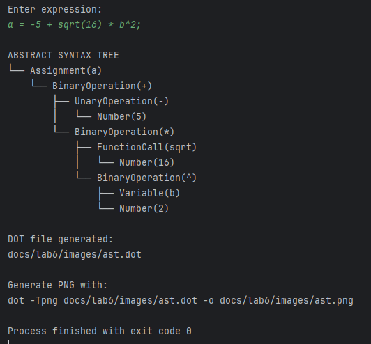
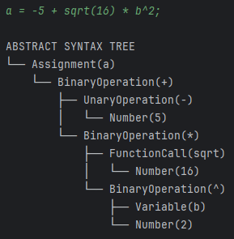
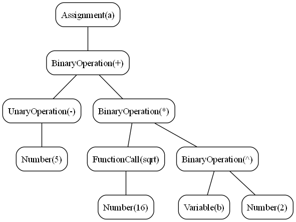

# Laboratory 6 – Parsing & Abstract Syntax Tree

### Course: Formal Languages & Finite Automata
### Author:

----

# Theory

Parsing is the process of analyzing a sequence of tokens in order to determine its syntactic structure according to a formal grammar. In compiler design, parsing represents the stage that follows lexical analysis.

While the lexer transforms raw characters into tokens, the parser uses these tokens to verify whether the input follows the grammatical rules of the language. If the input is syntactically correct, the parser builds a structured representation of the program.

One of the most common representations used during parsing is the **Abstract Syntax Tree (AST)**.


## Parsing

A parser receives a stream of tokens produced by the lexer and applies grammar rules to determine the structure of expressions or statements.

For example, the mathematical expression:

```text
x = 5 + 2 * 3
```

contains several operations with different precedence levels.

The parser must correctly interpret the structure as:

```text
x = 5 + (2 * 3)
```

instead of:

```text
(x = 5 + 2) * 3
```

This demonstrates that parsing is responsible not only for recognizing valid syntax, but also for preserving operator precedence and associativity.


## Recursive Descent Parsing

In this laboratory work, a **recursive descent parser** was implemented.

Recursive descent parsing is a top-down parsing technique where each grammar rule is represented by a method in the parser.

For example:

```text
expression → term ((+ | -) term)*
term       → factor ((* | / | %) factor)*
factor     → NUMBER
           | IDENTIFIER
           | '(' expression ')'
```

can be implemented directly as:

```java
private ASTNode expression()
private ASTNode term()
private ASTNode factor()
```

This approach is simple, readable, and commonly used in compiler construction.


## Abstract Syntax Tree (AST)

An Abstract Syntax Tree is a hierarchical representation of the syntactic structure of a program or expression.

Unlike a parse tree, the AST omits unnecessary grammar details and preserves only meaningful syntactic constructs.

For example, the expression:

```text
5 + 2 * 3
```

produces an AST similar to:

```text
       (+)
      /   \
    5      (*)
          /   \
         2     3
```

The AST clearly reflects operator precedence.


## AST Nodes

Each construct in the language is represented using a specific node type.

Examples:

- NumberNode
- VariableNode
- BinaryOperationNode
- UnaryOperationNode
- FunctionCallNode
- AssignmentNode

This design allows expressions to be represented recursively and processed later by semantic analyzers or interpreters.


## Operator Precedence

The parser implements operator precedence using separate parsing methods.

Priority order:

| Priority | Operators |
|--|--|
| Highest | functions, unary `+ -` |
| High | `^` |
| Medium | `* / %` |
| Low | `+ -` |
| Lowest | `=` |

This guarantees correct syntactic structure for mathematical expressions.


## Objectives

The objectives of this laboratory work were:

- Study the concept of parsing
- Understand recursive descent parsing
- Implement an Abstract Syntax Tree
- Extend the lexer developed in Laboratory 3
- Use regular expressions for token validation
- Parse arithmetic expressions and function calls
- Visualize the AST structure
- Generate graphical AST representations using Graphviz


# Implementation Description

The implementation extends the lexer developed in Laboratory 3 and introduces a parser together with a complete Abstract Syntax Tree hierarchy.

Project structure:

```text
src
 ├── lab1
 ├── lab2
 ├── lab3
 ├── lab4
 ├── lab5
 └── lab6
     ├── TokenType.java
     ├── Token.java
     ├── Lexer.java
     ├── Parser.java
     ├── ASTNode.java
     ├── NumberNode.java
     ├── VariableNode.java
     ├── BinaryOperationNode.java
     ├── UnaryOperationNode.java
     ├── FunctionCallNode.java
     ├── AssignmentNode.java
     ├── ASTVisualizer.java
     └── MainLab6.java

docs
 ├── lab1
 ├── lab2
 ├── lab3
 ├── lab4
 ├── lab5
 └── lab6
     ├── README.md
     └── images
```

The solution follows a modular architecture where lexical analysis, parsing, AST construction, and visualization are separated into independent components.


# TokenType Class

The `TokenType` enum defines all supported token categories.

```java
public enum TokenType {
    NUMBER("\\d+(\\.\\d+)?"),
    IDENTIFIER("[a-zA-Z_][a-zA-Z0-9_]*"),

    SIN("sin"),
    COS("cos"),
    TAN("tan"),
    SQRT("sqrt"),
    LOG("log"),

    PLUS("\\+"),
    MINUS("-"),
    MUL("\\*"),
    DIV("/"),
    MOD("%"),
    POW("\\^"),
    ASSIGN("="),

    LPAREN("\\("),
    RPAREN("\\)"),
    COMMA(","),
    SEMICOLON(";"),

    EOF("$");
}
```

Compared to Laboratory 3, the token definitions now include regular expressions used for validation.

This satisfies the laboratory requirement of categorizing tokens using regex-based patterns.


# Lexer Class

The lexer implementation from Laboratory 3 was reused and extended.

The lexer performs:

- tokenization
- keyword recognition
- number recognition
- operator recognition
- comment skipping
- whitespace skipping
- error handling

Numbers are recognized dynamically:

```java
private Token number() {
    StringBuilder sb = new StringBuilder();
    boolean hasDot = false;

    while (currentChar != '\0'
            && (Character.isDigit(currentChar)
            || currentChar == '.')) {

        if (currentChar == '.') {
            if (hasDot) {
                throw error("Invalid number format");
            }
            hasDot = true;
        }

        sb.append(currentChar);
        advance();
    }

    return new Token(TokenType.NUMBER, sb.toString(),
            startPos, startLine, startColumn);
}
```

Identifiers and keywords are processed similarly:

```java
private Token identifierOrKeyword() {
    String word = sb.toString();

    return switch (word) {
        case "sin" -> new Token(TokenType.SIN, word,
                startPos, startLine, startColumn);

        case "cos" -> new Token(TokenType.COS, word,
                startPos, startLine, startColumn);

        default -> new Token(TokenType.IDENTIFIER, word,
                startPos, startLine, startColumn);
    };
}
```

The lexer therefore acts as the first stage of processing and provides structured tokens for the parser.


# Parser Class

The parser implements recursive descent parsing.

Main grammar:

```text
statement  → IDENTIFIER '=' expression
           | expression

expression → term ((+ | -) term)*

term       → power ((* | / | %) power)*

power      → factor ('^' power)?

factor     → NUMBER
           | IDENTIFIER
           | FUNCTION '(' expression ')'
           | '(' expression ')'
           | (+ | -) factor
```

Each grammar rule corresponds directly to a parser method.

Example:

```java
private ASTNode expression() {
    ASTNode node = term();

    while (currentToken().getType() == TokenType.PLUS
            || currentToken().getType() == TokenType.MINUS) {

        Token operator = currentToken();

        if (operator.getType() == TokenType.PLUS) {
            eat(TokenType.PLUS);
        } else {
            eat(TokenType.MINUS);
        }

        node = new BinaryOperationNode(node, operator, term());
    }

    return node;
}
```

This implementation naturally preserves operator precedence.


# AST Structure

The AST is implemented using inheritance.

Base class:

```java
public abstract class ASTNode {
    public abstract String print(String prefix, boolean isTail);
}
```

Derived node types:

- `NumberNode`
- `VariableNode`
- `BinaryOperationNode`
- `UnaryOperationNode`
- `FunctionCallNode`
- `AssignmentNode`

Each node stores only the information relevant to that construct.


# BinaryOperationNode

Binary operations such as addition or multiplication are represented using a binary tree structure.

```java
public class BinaryOperationNode extends ASTNode {

    private final ASTNode left;
    private final Token operator;
    private final ASTNode right;
}
```

This representation directly models expression hierarchy.


# FunctionCallNode

Mathematical functions are represented using dedicated AST nodes.

Example:

```text
sqrt(16)
```

produces:

```text
FunctionCall(sqrt)
    Number(16)
```

Implementation:

```java
public class FunctionCallNode extends ASTNode {

    private final String functionName;
    private final ASTNode argument;
}
```


# AST Visualization

The AST can be displayed in two forms:

1. Console tree representation
2. Graphviz graphical representation

Console example:

```text
└── BinaryOperation(+)
    ├── Number(5)
    └── BinaryOperation(*)
        ├── Number(2)
        └── Number(3)
```

This representation makes the structure of the expression easy to understand.


# Graphviz Visualization

The `ASTVisualizer` class generates a `.dot` file that can be converted into a graphical image.

```java
public static void generateDot(ASTNode root,
                               String fileName)
```

Generated command:

```bash
dot -Tpng docs/lab6/images/ast.dot \
-o docs/lab6/images/ast.png
```

This produces a complete graphical AST representation.


# Results

The parser successfully processes arithmetic expressions, assignments, unary operations, exponentiation, and mathematical function calls.

The selected example expression demonstrates multiple parser features simultaneously, including assignment operations, unary operators, function calls, exponentiation, and precedence handling.

Example input:

```text
a = -5 + sqrt(16) * b^2;
```

Generated AST:

```text
└── Assignment(a)
    └── BinaryOperation(+)
        ├── UnaryOperation(-)
        │   └── Number(5)
        └── BinaryOperation(*)
            ├── FunctionCall(sqrt)
            │   └── Number(16)
            └── BinaryOperation(^)
                ├── Variable(b)
                └── Number(2)
```

The structure correctly preserves operator precedence and nesting.


# Screenshots

## 1. Program Execution



The console output demonstrates successful parsing and AST generation for complex mathematical expressions involving assignments, unary operators, function calls, exponentiation, and operator precedence.


## 2. AST Tree Representation



Shows the hierarchical tree representation printed directly in the console.


## 3. Graphviz AST Image



Displays the graphical AST generated using Graphviz from the `.dot` file.


# Conclusion

In this laboratory work, the concepts of parsing and Abstract Syntax Trees were studied and implemented through the development of a recursive descent parser in Java.

The implementation extends the lexer created in Laboratory 3 and introduces a complete syntactic analysis stage capable of processing arithmetic expressions, assignments, unary operators, exponentiation, and mathematical function calls.

The parser successfully converts a linear sequence of tokens into a hierarchical Abstract Syntax Tree, preserving operator precedence and expression structure. The AST implementation demonstrates how programming language constructs can be represented using recursive data structures and object-oriented design.

An important aspect of the project is the clear separation between lexical analysis and parsing. The lexer is responsible only for tokenization, while the parser performs syntactic analysis and AST construction. This separation reflects the architecture used in real compiler systems.

Additionally, the implementation includes graphical visualization using Graphviz, which provides a clear representation of the generated syntax trees and improves understanding of the parsing process.

Overall, this laboratory demonstrates the practical application of formal grammars, recursive descent parsing, and tree-based program representation. It also establishes the foundation for future stages such as semantic analysis, interpretation, or code generation.


# References

[1] Parsing – Wikipedia  
https://en.wikipedia.org/wiki/Parsing

[2] Abstract Syntax Tree – Wikipedia  
https://en.wikipedia.org/wiki/Abstract_syntax_tree