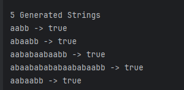
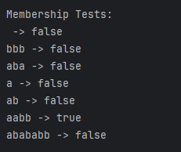

# Laboratory 1 - Intro to formal languages. Regular grammars. Finite Automata

### Course: Formal Languages & Finite Automata
### Author: Felicia Ojog
### Variant: 19

----

## Theory

A **formal language** is a mathematically defined set of strings constructed over a finite alphabet. It provides a precise way of describing communication systems, programming languages, and computational models.


### Alphabet (Σ)

An **alphabet** is a finite, non-empty set of symbols.

In this laboratory work:

Σ = { a, b }


### Strings and Language

A **string (word)** is a finite sequence of symbols from the alphabet Σ.

The set of all possible strings over Σ is denoted by **Σ\***.

A **language** is any subset of Σ\*.  
In this laboratory, the language is defined by a formal grammar.


### Formal Grammar

A formal grammar is defined as a 4-tuple:

G = (V_N, V_T, P, S)

Where:

- **VN** – set of non-terminal symbols
- **VT** – set of terminal symbols (alphabet)
- **P** – set of production rules
- **S** – start symbol

Non-terminals are symbols that can be replaced using production rules.  
Terminals are symbols that appear in the final generated strings.

For Variant 19:

- VN = {S, A, B, C}
- VT = {a, b}
- S = S

Productions:

- S → aA
- A → bS
- A → aB
- B → bC
- C → aA
- C → b

This grammar is **right-linear**, because all productions are of one of the following forms:

- A → aB (a terminal followed by a non-terminal)
- A → a  (a single terminal)

where `a` represents a terminal symbol from the alphabet Σ.

All production rules respect this structure, meaning that the non-terminal (if present) appears only on the rightmost side of the production.

According to the **Chomsky hierarchy**, such grammars are classified as **Type 3 (Regular) grammars**.

Regular grammars generate **regular languages**.


### Deterministic Finite Automaton (DFA)

A Deterministic Finite Automaton is defined as:

M = (Q, Σ, δ, q₀, F)

Where:

- **Q** – finite set of states
- **Σ** – input alphabet
- **δ** – transition function
- **q₀** – initial state
- **F** – set of final (accepting) states

The automaton reads an input string symbol by symbol and changes states according to the transition function δ.


A string is **accepted** if, after processing all symbols, the automaton reaches a final state.


### Equivalence Between Regular Grammars and Finite Automata

A fundamental result in formal language theory states that:

> Every regular grammar has an equivalent finite automaton, and every finite automaton has an equivalent regular grammar.

In this laboratory work, the given regular grammar is converted into a deterministic finite automaton, and both representations describe the same language.


## Objectives:

- Create a GitHub repository for the laboratory works.
- Implement a class that models a regular grammar.
- Generate 5 valid strings from the grammar.
- Convert the grammar into a deterministic finite automaton.
- Implement a method that checks whether a string belongs to the language.
- Demonstrate the equivalence between grammar and automaton.


## Implementation description


The solution is structured using three main classes:

- `Grammar`
- `FiniteAutomaton`
- `Main`

Each class models a theoretical component from formal language theory.


### Grammar Class

The `Grammar` class models the formal grammar:

```
G = (VN, VT, P, S)
```

It stores:

- `VN` – set of non-terminal symbols
- `VT` – set of terminal symbols
- `P` – production rules
- `S` – start symbol

#### Grammar Initialization (Variant 19)

```java
public static Grammar variant19() {
    Set<String> VN = Set.of("S", "A", "B", "C");
    Set<Character> VT = Set.of('a', 'b');

    Map<String, List<String>> P = new HashMap<>();
    P.put("S", List.of("aA"));
    P.put("A", List.of("bS", "aB"));
    P.put("B", List.of("bC"));
    P.put("C", List.of("aA", "b"));

    return new Grammar(VN, VT, P, "S");
}
```


#### String Generation

The method `generateString(int maxSteps)` simulates the derivation process starting from the start symbol `S`.  
It repeatedly replaces non-terminals using randomly selected production rules until only terminal symbols remain.

```java
public String generateString(int maxSteps) {
    String current = startSymbol;
    int steps = 0;

    while (containsNonTerminal(current) && steps < maxSteps) {
        int index = firstNonTerminalIndex(current);
        String nonTerminal = String.valueOf(current.charAt(index));

        List<String> productions = P.get(nonTerminal);
        String chosen = productions.get(random.nextInt(productions.size()));

        current = current.substring(0, index)
                + chosen
                + current.substring(index + 1);

        steps++;
    }

    return current;
}
```

This method ensures that valid strings are generated according to the grammar rules.


### Conversion to Finite Automaton

The grammar is converted into a deterministic finite automaton (DFA) using the standard transformation:

- `A → aB`  becomes  `δ(A, a) = B`
- `A → a`   becomes  `δ(A, a) = X` (final state)

```java
public FiniteAutomaton toFiniteAutomaton() {
    Set<String> states = new HashSet<>(VN);
    states.add("X");

    Set<String> finalStates = Set.of("X");

    Map<String, Map<Character, String>> delta = new HashMap<>();

    for (String state : VN) {
        delta.put(state, new HashMap<>());

        for (String production : P.getOrDefault(state, List.of())) {

            char terminal = production.charAt(0);

            if (production.length() == 2) {
                String nextState = String.valueOf(production.charAt(1));
                delta.get(state).put(terminal, nextState);
            } else {
                delta.get(state).put(terminal, "X");
            }
        }
    }

    return new FiniteAutomaton(states, VT, delta, startSymbol, finalStates);
}
```

A new final state `X` is introduced to handle productions of the form `A → a`.
Since no non-terminal has two productions starting with the same terminal symbol, the resulting automaton is deterministic.  
For each state and input symbol, there is at most one possible transition. Therefore, the constructed automaton satisfies the definition of a DFA.

### FiniteAutomaton Class

The `FiniteAutomaton` class models the DFA:

```
M = (Q, Σ, δ, q0, F)
```

Where:

- `Q` – set of states
- `Σ` – input alphabet
- `δ` – transition function
- `q0` – initial state
- `F` – set of final states


#### Membership Checking

The method `stringBelongToLanguage(String input)` verifies whether a string is accepted by the automaton.  
It simulates the transition function step by step.

```java
public boolean stringBelongToLanguage(String input) {
    String current = startState;

    for (int i = 0; i < input.length(); i++) {
        char symbol = input.charAt(i);

        if (!alphabet.contains(symbol)) {
            return false;
        }

        Map<Character, String> transitions = delta.get(current);
        if (transitions == null || !transitions.containsKey(symbol)) {
            return false;
        }

        current = transitions.get(symbol);
    }

    return finalStates.contains(current);
}
```

The method returns `true` only if, after processing the entire input string, the automaton reaches a final state.


### Main Class

The `Main` class demonstrates execution of the implemented components:

```java
Grammar grammar = Grammar.variant19();
FiniteAutomaton fa = grammar.toFiniteAutomaton();

List<String> words = grammar.generate5Strings();

for (String word : words) {
        System.out.println(word + " -> " +
        fa.stringBelongToLanguage(word));
}
```

This confirms that:

- The grammar generates valid strings.
- The corresponding automaton accepts those strings.
- The equivalence between the regular grammar and the DFA holds.


## Conclusions / Screenshots / Results

### Generated Strings

Using the implemented `generateString()` method, the grammar successfully produced valid strings belonging to the language defined by Variant 19.

Example generated strings:

1. aabb
2. abaabb
3. aababaabaabb
4. abaababababaababaabb
5. aabaabb




### Observed Language Structure

From the execution results and theoretical analysis, the following structural properties were confirmed:

- Every generated string starts with the symbol `a`, since the only production for the start symbol is `S → aA`.
- The derivation can terminate only through the rule `C → b`.
- Therefore, every valid string ends with the symbol `b`.

The grammar follows a cyclic structure:

S → A → (S or B) → C → A → ...

This recursive behavior explains the alternating patterns of `a` and `b` observed in the generated strings.


### Membership Testing Results

The constructed deterministic finite automaton (DFA) was used to verify language membership.

Example tests:

ab -> true  
abab -> true  
abaab -> true  
aba -> false  
baba -> false  
aabb -> false



### DFA Structure

The grammar was converted into a deterministic finite automaton using the standard transformation rules:

- A → aB becomes δ(A, a) = B
- A → a becomes δ(A, a) = X (final state)

The automaton contains the states:

Q = {S, A, B, C, X}

Where X is the only final state.


## Conclusions

In this laboratory work, the theoretical concepts of regular grammars and deterministic finite automata were implemented and analyzed in practice.

A right-linear grammar (Variant 19) was modeled programmatically and used to generate valid strings. The grammar was then converted into an equivalent deterministic finite automaton using the standard transformation rules for regular grammars.

The experimental results confirmed the theoretical equivalence between regular grammars and finite automata. The DFA correctly accepts all valid strings generated by the grammar and rejects invalid ones.

This laboratory strengthened the understanding of:

- The structure of regular grammars
- The construction of deterministic finite automata
- The relationship between recursive productions and state transitions
- The practical verification of language membership

The implementation demonstrates how abstract formal language theory can be translated into concrete computational models.

## References

[1] Formal Languages & Finite Automata – Theme 1: Regular Grammars, Laboratory Material (PDF).

[2] Formal Languages & Finite Automata – Lecture 22 Presentation, Course Slides (PDF).